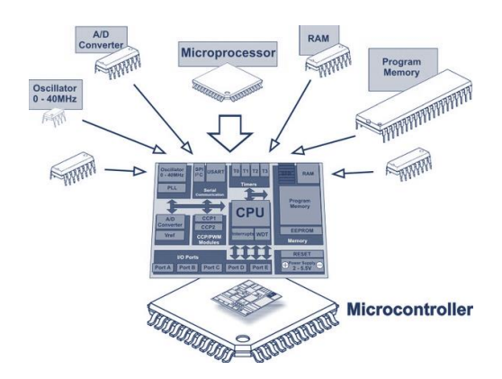
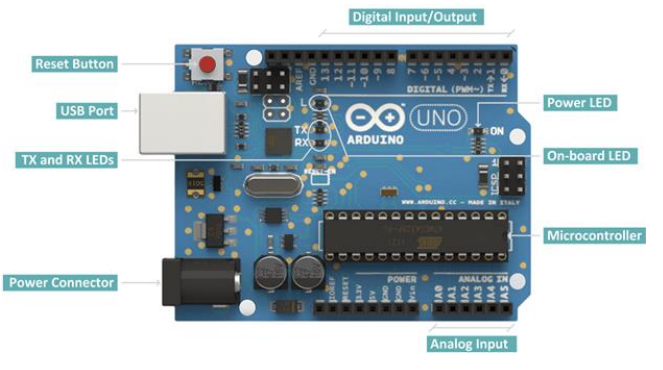
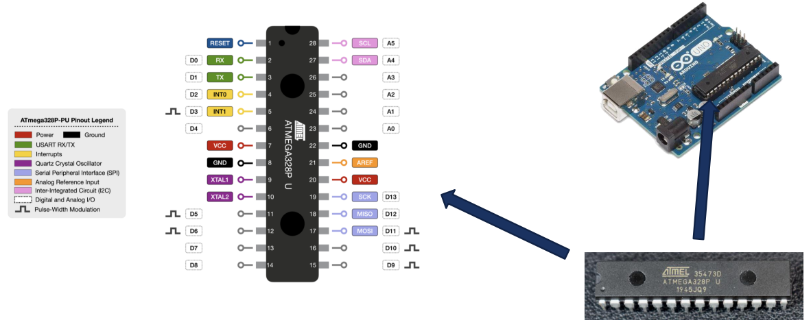
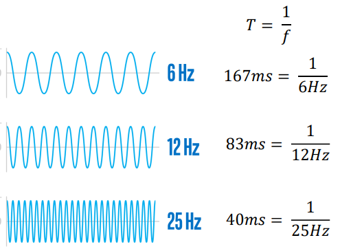
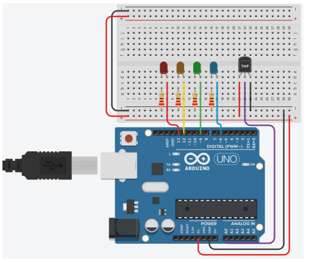

# Deployment Boards 

    Module Code: GEEN1064

    Module Name: Engineering Design and Implementation

    Lecturer: Seb Blair BEng(H) PGCAP MIET MIHEEM FHEA

---

## What is (and isn't) a Microncontoller ($\mu$C)

- A µC is a small, self-contained computer that is housed on a
  single integrated circuit, or microchip.

- They differ from your desktop computer in that they are typically dedicated to a single function, and are most often embedded in other devices (e.g. mobile phones; household electronics).

- A µC is an Integrated Circuit (IC) device used for controlling other portions of an electronic system

- These devices are optimized for embedded applications that require both processing functionality and agile, responsive interaction with digital, analogue, or electromechanical components.

---

## What is (and isn't) a Microncontoller ($\mu$C)

- µC” is a well-chosen name because it emphasizes defining characteristics of this product category. The prefix “µ” implies smallness and the term "controller" here implies an enhanced ability to perform control functions.

-  As stated above, this functionality is the result of combining a digital processor and digital memory with additional hardware that is specifically designed to help the µC interact with other components.

---

## Microcontroller vs a Microprocessor

- µP contain only a Central Processing Unit (CPU), and therefore require added peripherals to perform tasks.

- CPU is the brain of any computer and it is the part of a computer that performs calculations, actions, and runs programs.
  - Intel Core i series, AMD


---

## RAM and ROM

- µCs, on the other hand, contain RAM, ROM, and similar peripherals, which allow them to perform (simple) tasks independently.

- Random-Access Memory (RAM)
  - everyday tasks, such as loading applications, browsing the internet,editing a spreadsheet, or experiencing the latest game

- Read-Only Memory (ROM)  
  - computer memory chips containing permanent or semi-permanent data. Unlike RAM, ROM is non-volatile; even after you turn off your computer, the contents of ROM will remain

---

## Exploded View



---

## Deployment Platforms

- Prototyping platforms
  - Arduino family -> Uno, Mega, MKR series…
  - Single board computers -> Raspberry Pi, Orange Pi, Odroid, Jetson Nano….
- Used to build physical computing projects
  - Taking information from the world around us by using inputs such as sensors and switches and responding to that information with outputs like actuators, graphical indicators, lights etc.
- Open source hardware and software
  
- Open source projects emphasise the importance of documentation and sharing,
making the community of users a great resource for learners.

---

## Arduino Uno

Prototype Board from Arduino
- The Uno is a µC development board with an Atmega328P Chip
- 14 digital Input/Output (I/O) pins
- 6 Analogue I/O pins (e.g. temperature sensors)
- A 16 MHz quartz crystal



---

## ATMega-328P Chip



---

## Clock Speed

The clock speed measures the number of cycles your CPU executes per second, measured in GHz or MHz (giga/megahertz).

A “cycle” is technically a pulse synchronized by an internal oscillator, but for our purposes, they’re a basic unit that helps understand a CPU’s speed. During each cycle, billions of transistors within the processor open and close.




---

## Clock Speed
<div align=right>

$T = \frac{1}{f}$

</div>

1. So how fast is the ATMega328P at 16MHZ?

<details>
<summary>Answer</summary>

$$
\begin{equation*}
    62.5ns \leftarrow 6.25 \cdot 10^{-8} = \frac{1}{16 \cdot 10^6} \equiv \frac{1}{16MHz}
\end{equation*}
$$

</details>

2. or Intel i5-9600k processor at 3.2GHz

<details>
<summary>Answer</summary>

$$
\begin{equation*}
    312.5ps \leftarrow 3.125 \cdot 10^{-10} = \frac{1}{3.2 \cdot 10^9} \equiv \frac{1}{3.2GHz}
\end{equation*}
$$

</details>

3. or Intel i9-14900KF Processor at 9.044GHz (Overclocked)

<details>
<summary>Answer</summary>

$$
\begin{equation*}
    110.57ps \leftarrow 1.1057 \cdot 10^{-10} = \frac{1}{9.044 \cdot 10^9} \equiv \frac{1}{9.044GHz}
\end{equation*}
$$
</details>

---

## Progamming a $\mu C$

Like all µC they only work if they are programmed to. Generally they are programmed using `C/C++`, `Assembly` programming languages which all compile down to binary. 

<div align=center>
<table>
<tr>
<td>
Assembly

```asm
add:
    push rbp
    mov rbp, rsp
    mov DWORD PTR [rbp-4], edi
    mov DWORD PTR [rbp-8], esi
    mov edx, DWORD PTR [rbp-4]
    mov eax, DWORD PTR [rbp-8]
    add eax, edx
    pop rbp
ret
```

</td>

<td>
C/C++

```c
int add(int num){
  return num + num;
}
```

</td>
</tr>
</table>
</div>

Don’t worry will not be programming in Assembly, `C/C++` is a language we can understand easily as it more human readable.

---

## Simulation Time

We are going to use tinkercad to simulated in using a microcontroller in a safe environment.


[www.tinkercad.com](www.tinkercad.com)


