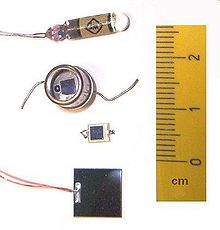
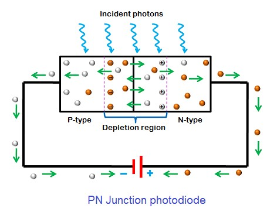

# Implementing the Optical Tachometer using a Integrated Circuit

    Module Code: GEEN1064

    Module Name: Engineering Design and Implementation

    Credits: 20

    Lecturer: Seb Blair BEng(H) PGCAP MIET MIHEEM FHEA

---

## Detecting Light

-  Photoresistor
-  Photodiode
-  Phototransitor




---

## Photoresistor

- Material: highly-resistance semiconductor material called Cadmium Sulfide cell, $Cd^{2+}S^{2-}$, which is highly sensitive to visible and near-infrared light

- Warning: is a known carcinogen and is associated with an elevated risk of developing lung cancer!

- Characteristics:
   - High light intensity -> a lower resistance

  -  Low light intensity -> in a higher resistance


---

## Photodiode




---

## Phototransistor 


- Phototransistors have less ability to maintain a linear relationship between illuminance and output current. 
 
- Brighter light results in more current; less-bright light results in less current.


---

## Theories

**Volage divider:**

<div align=center>

$V_{Rx} = V{s}\cdot\frac{R1}{R1 + R2}$

$0.45v = 5v\cdot\frac{1000\Omega}{1000\Omega + 10000\Omega}$

</div>

**Ohms Law:**

<div align=center>

$V = I*R$

$I = \frac{V}{R}$

$R = \frac{V}{I}$


</div>

--- 

## Testing light sensitivity : Circuit


---
## Testing light sensitivity : Code

We are going to build a circuit with 


```c
int adc = 0,resistance = 10000;
float voltage = 0, current = 0;

void setup(){
  Serial.begin(9600);
}

void loop{
   adc = analogRead(5);
   voltage = adc / 1023 * 5; // adcMax = 1023 * supplied voltage -> 5V
   current = voltage / resistance; // Ohms law, provides approximation 
   Serial.print("Voltage: ");
   Serial.print(voltage);
   Serial.print(" Current: ");
   Serial.print(current);
   Serial.print(" ADC: ");
   Serial.println(adc);
}
```


--- 

## [taˈkɒmɪtə]


--- 


---
## TC1602A - LCD


<!--
RS mode 0 -> Command mode
RS mode 1 -> Data mode
RW (Pin 5): Read/Write. This pin selects between read (RW=1) and write (RW=0) operations. Often connected to ground for write-only operations.
E (Pin 6): Enable. This pin is used to enable data transfers to the LCD module.
-->
