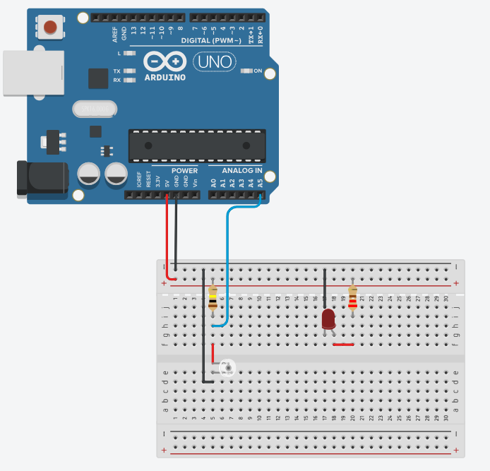
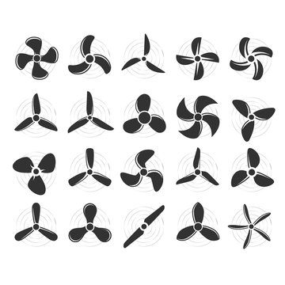
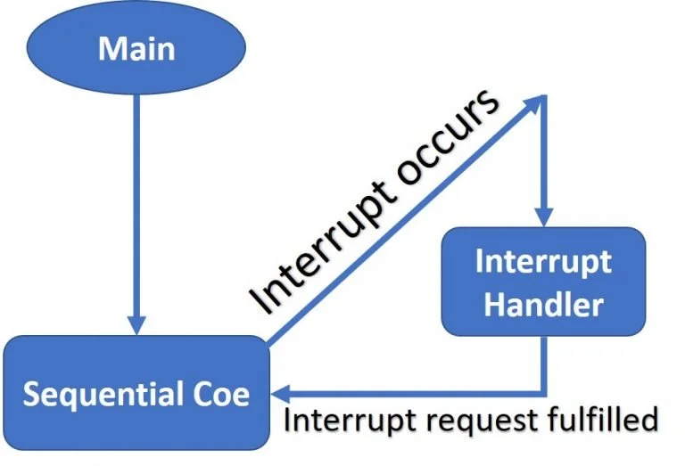
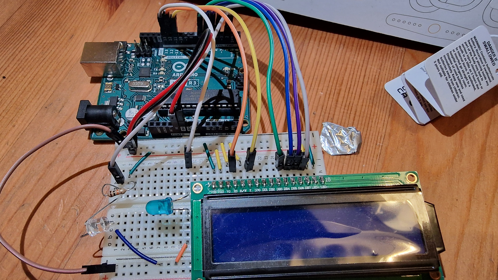

# Implementing the Optical Tachometer using a Integrated Circuit

    Module Code: GEEN1064

    Module Name: Engineering Design and Implementation

    Credits: 20

    Lecturer: Seb Blair BEng(H) PGCAP MIET MIHEEM FHEA

---

## Detecting Light

-  Photoresistor
-  Photodiode
-  Phototransitor


---

## Photoresistor

- Material: highly-resistance semiconductor material called Cadmium Sulfide cell, $Cd^{2+}S^{2-}$, which is highly sensitive to visible and near-infrared light

- Warning: is a known carcinogen and is associated with an elevated risk of developing lung cancer!

- Characteristics:
   - High light intensity -> a lower resistance

  -  Low light intensity -> in a higher resistance


---

## Photodiode


---

## Phototransistor 


- Phototransistors have less ability to maintain a linear relationship between illuminance and output current. 
 
- Brighter light results in more current; less-bright light results in less current.


---

## Theories

**Volage divider:**

<div align=center>

$V_{out} = \frac{R1}{R1 + R2}\cdot V_{in}$

$$ 3.18V = \frac{470\Omega}{270\Omega+470\Omega} \cdot 5V \Lleftarrow V_{out} = \frac{R2}{R1 + R2} \cdot V_{in} $$

</div>

**Ohms Law:**

<div align=center>

$V = I*R$

$I = \frac{V}{R}$

$R = \frac{V}{I}$


</div>

--- 

## Testing light sensitivity : Circuit



 - we are doing this physically
---
## Testing light sensitivity : Code

- Try different colour LEDs and distances, is there a difference?

```c
int adc = 0,resistance = 10000;
float voltage = 0, current = 0;

void setup(){
  Serial.begin(9600);
}

void loop(){
   adc = analogRead(5);
   voltage = adc / 1023 * 5; // adcMax = 1023 * supplied voltage -> 5V
   current = voltage / resistance; // Ohms law, provides approximation 
   Serial.print("Voltage: ");
   Serial.print(voltage);
   Serial.print(" Current: ");
   Serial.print(current);
   Serial.print(" ADC: ");
   Serial.println(adc);
}
```

---

## Propeller/Turbines



- RPM 
  - is more practical and widely used in engineering and everyday settings where specific rotational speeds need to be specified and monitored
- Angular Velocity ($\omega$)
  - is more commonly used in theoretical and analytical studies of rotational motion.

<div align="center">

$\omega = \frac{2\Pi\  \cdot\ RPM}{60}$

</div>


---

## Matlab code

- Open and Create a script, call it what you like.

```matlab
clear 
close all hidden
clc

% Manually declare the RPM array
RPM = [0, 100, 150, 264, 304, 418, 500, 526, 526, 526, 526, 526, 526, 524, 524, 526, 526, 526, 526, 526, 526, 526, 450];

% Number of data points
num_points = numel(RPM);

% Time in minutes
T_mim = (0:num_points-1).';

% Calculate rad/m
rad_per_m = pi() * 2 * RPM;

% Calculate rad/s
rad_per_s = rad_per_m / 60;

% Calculate delta rad/s
delta_rad_per_s = [0; diff(rad_per_s')]; % transpose 1 by 23 to 23 by 1

% Calculate rad/s^2
rad_per_s_squared = delta_rad_per_s ./ [0; diff(T_mim)]; % multiplication of array elements
```
 
---

## Matlab code Part 2

```matlab
% Create figure
figure;

% Create bar plot for RPM
yyaxis left;
bar(T_mim, RPM);
xlabel('T_{min}');
ylabel('RPM');
title('RPM vs Rad/s^2');
grid on;

% Create line plot for rad_per_s_squared
yyaxis right;
plot(T_mim, rad_per_s_squared, 'LineWidth', 2,'Marker','*');
ylabel('Rad/s^2 (Line)');

% Show legend
legend('Rad/s', 'Rad/s^2');

% Adjust y-axis limits for line plot
ylim_right = ylim;
ylim_right(1) = min(ylim_right(1), 0); % Ensure minimum value is 0
yyaxis right;
ylim(ylim_right);

% Adjust figure layout
grid on;
```

---
## Tachometer Circuit Design
**[taˈkɒmɪtə]**


---

## Arduino [taˈkɒmɪtə] code

```c
unsigned int rpm = 0;
int count = 0, timeOld = 0;
const float distance_per_revolution_mm = 88.86;

void setup(){
  Serial.begin(9600);
}

void loop(){
  delay(1000);

  for (int i = 0; i < 60; i++)
  {
    if (analogRead(5) < 80){
       count++;
    }
  }
  //(30 = 2 blades) (20 = 3 blades) (15 = 4 blades) (12 = 5 blades)
  rpm = (2 * rpmcount * 60000) / (millis() - timeold) * distance_per_revolution;

  Serial.print("RPM: ");
  Serial.println(rpm);
  timeOld = millis();

}
```

---

## Interrupts

- Micro Controllers can only do one thing at a time. 
- We use interrupts to break out of what is currently being executed
  - External Interrupts (Pins)
  - Timer/Counter Interrupts (internal clock)
  - Serial Communication Interrupts (receiving data)
  - ADC Conversion Complete Interrupt (`analogRead()`)



---
## TC1602A - LCD


<!--
RS mode 0 -> Command mode
RS mode 1 -> Data mode
RW (Pin 5): Read/Write. This pin selects between read (RW=1) and write (RW=0) operations. Often connected to ground for write-only operations.
E (Pin 6): Enable. This pin is used to enable data transfers to the LCD module.
-->
---

**Adding the LCD to the current ciruit**

<div align=center>



</div>

---

## Final code Pt1


```c
// include the library code:
#include "LiquidCrystal.h"

int ledPin = 13; // LED connected to digital pin 13
volatile byte rpmcount = 0;
unsigned int rpm = 0;
unsigned long timeold = 0;

int max_steps = 80; // 16 blocks in lcd screen * 5 rows in each block.

int max_rpm = 4000; //set # to max of what you are measuring - stiriling engine can go to 600rpm + 400 incase of threshold.

int steps = 0; // Math to visualise the rpm on lcd as a percentage bar.

// initialize the library with the numbers of the interface pins
LiquidCrystal lcd(12, 11, 7, 6, 5, 4);

//Create the progress bar characters
byte p20[8] = {B10000,B10000,B10000,B10000,B10000,B10000,B10000,B10000,};
byte p40[8] = {B11000,B11000,B11000,B11000,B11000,B11000,B11000, B11000,};
byte p60[8] = {B11100,B11100,B11100,B11100,B11100,B11100,B11100,B11100,};
byte p80[8] = {B11110,B11110,B11110,B11110,B11110,B11110,B11110,B11110,};
byte p100[8] = {B11111,B11111,B11111,B11111,B11111,B11111,B11111,B11111,};

void rpm_count()
{
  // Each rotation this 'interrupt function' is ran twice, so take that into consideration for
  // calculating RPM and Update count.
  rpmcount++;
}
```

---

## Final Code Pt2

```c
void setup()
{
  Serial.begin(9600);
  lcd.begin(16, 2);  // intialise the LCD
  lcd.print("UoG RPM Counter!"); // Welcome message.

  lcd.setCursor(0, 1);
  //Make progress bar characters
  lcd.createChar(0, p20); lcd.createChar(1, p40); lcd.createChar(2, p60); 
  lcd.createChar(3, p80); lcd.createChar(4, p100);
  lcd.print("                ");  // Clear the line each time it reaches the end with 16 " " (spaces).

  for (int i = 0; i < 16; i++) // Iterate through each character on the second line
  {
    for (int j = 0; j < 5; j++) // Iterate through each progress value for each character
    {
      lcd.setCursor(i, 1); // Move the cursor to this location
      lcd.write(j);        // update progress bar
      delay(10);          // wait
    }
  }

  // Interrupt 0 is digital pin 2,  where the Photodiode should be connected
  // Triggers on FALLING (change from HIGH to LOW)
  attachInterrupt(0, rpm_count, FALLING);

  //Turn on LED in pin 13
  pinMode(ledPin, OUTPUT);
  digitalWrite(ledPin, HIGH);
  delay(10);// delay to stop ledPin HIGH being counted at start of void loop.
}
```

---
## Final Code Pt3

```c
void loop()
{
  // Update RPM every second
  delay(1000);
  // Don't process interrupts during calculations
  detachInterrupt(0);

  // Do all processes when interrupt is disabled.

  // Note that this would be 60*1000/(millis() - timeold)*rpmcount if the interrupt
  // happened once per revolution instead of twice. (30 = 2 blades) (20 = 3 blades) (15 = 4 blades) (12 = 5 blades)
  rpm = 30 * 1000 / (millis() - timeold) * rpmcount;
  steps = (int)(((float)rpm / (float)max_rpm) * max_steps); // Math to visualise the rpm on lcd as a percentage bar.

  rpmcount = 0; // reset counter

  //Graphical output for void loop() to lcd screen.
  //Print out result to lcd
  lcd.clear();
  lcd.print("RPM = ");
  lcd.print(rpm);

  // Visualise the rpm result on the percentage bar.
  lcd.setCursor(0, 1); //(column, row)
  lcd.print("                "); //Clear the line each time it reaches the end with 16 " " (spaces).

  //Iterate through each progress value for each character.
  for (int j = 0; j < steps; j++)
  {
    lcd.setCursor((j / 5), 1); //Move the cursor to this location.
    lcd.write(j % 5);         //update progress bar with remainder as this will go up ensure 1 column accuracy across 5 columns.
  }
  timeold = millis(); // get new time before starting interrupt again
  //Restart the interrupt processing
  attachInterrupt(0, rpm_count, FALLING);
}

```

