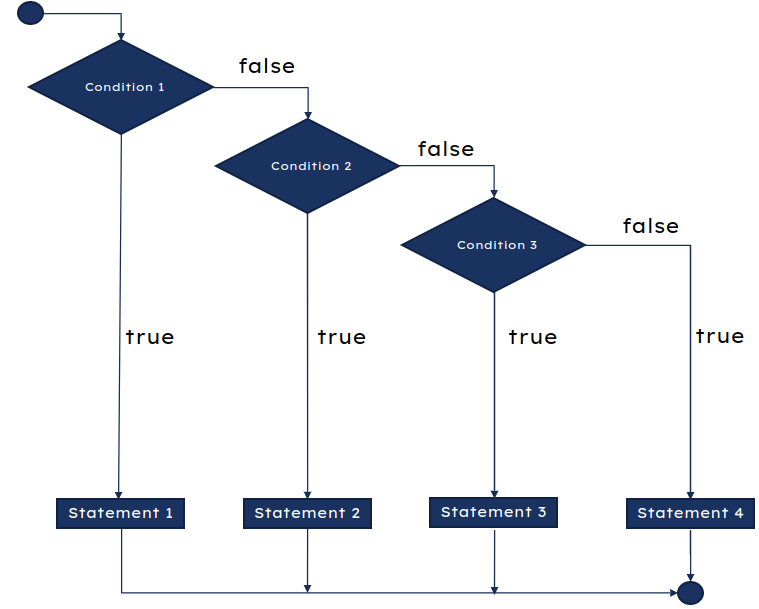
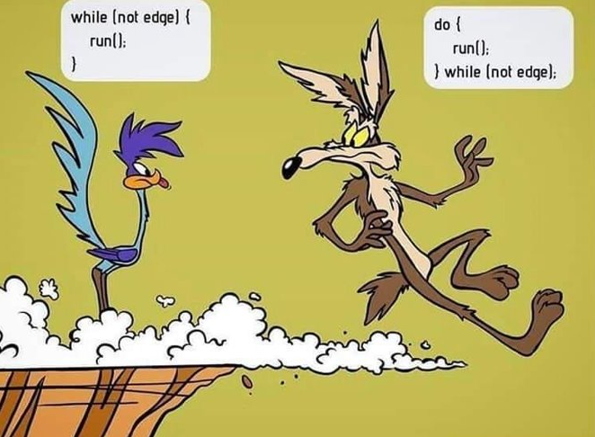
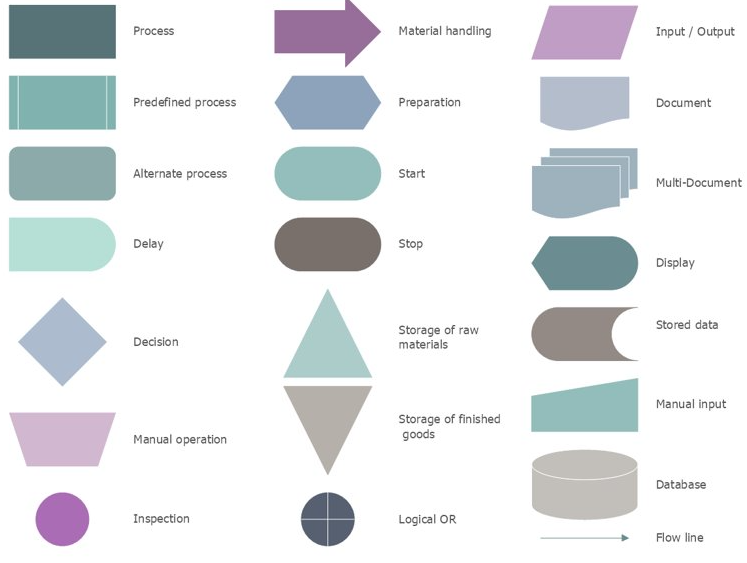
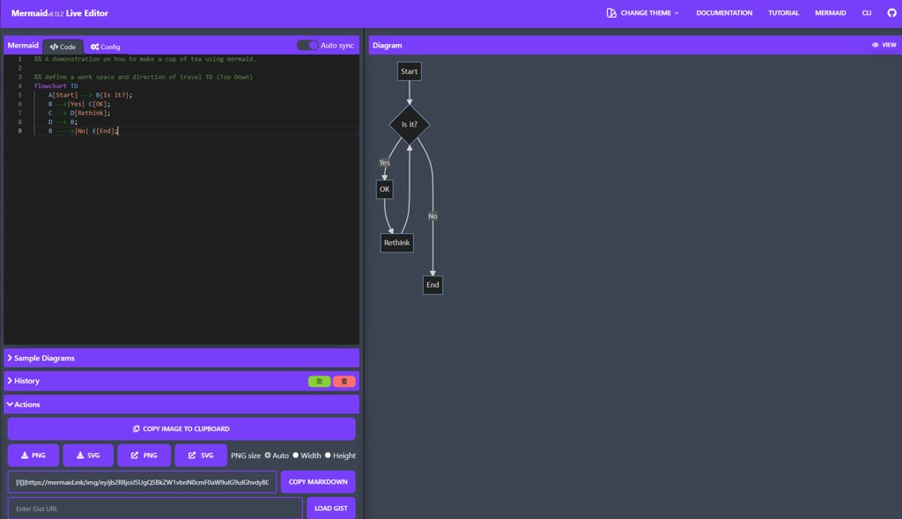
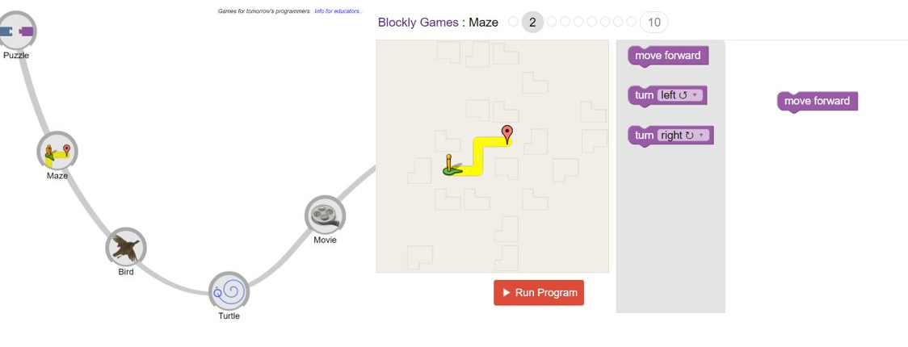
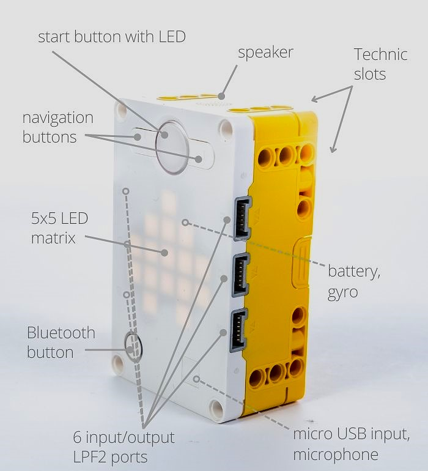
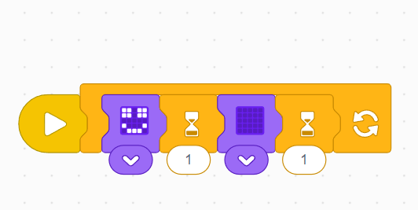
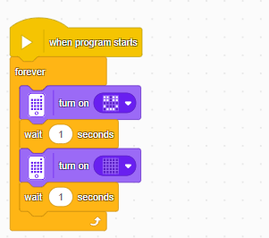
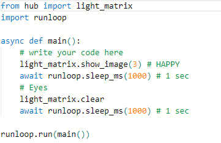

<!-- _footer: "[Download as a PDF](https://github.com/UniOfGreenwich/GEEN1064-Lectures/raw/gh-pages/content/ProgrammingComputers/ProgrammingComputers.pdf)" -->

# Programming and Flow Diagrams

    Course Code: GEEN1064 
    
    Course Name: Engineering, Design and Implementation

    Credits: 20

    Lecturer: Seb Blair BEng(H) PGCAP MIET MIHEEM FHEA

---


---

## What is programming?

<details>
<summary>?</summary>

A programming language is a computer language programmers use to develop software programs, scripts, or other sets of instructions for computers to execute​...

</details>


<details>
<summary>Why program?​</summary>

Automate process​, Create digital records​, Communication ,Simulation/emulation​, …​

But ultimately programming provides instructions on how hardware is controlled, remember at the end of the day it is all zeroes and ones that represent electrical signals.​

</details>

---

## Types of Programming Languages

- High Level / low level – C#, Java, Python, Ruby, C, C++, assembly ​

- Declarative / imperative/procedural – SQL, Curl, Prolog​

- General-purpose/domain specific – HTML, Markdown/up, MATLAB​

- Object-orientated/concurrent – C#, Java, Python,​

- Command/complied/script language – batch, bash, Javascript​

- Answer set - Prolog

---

## Human Language and Programming Languages


<details>

<summary>Are all programming languages in English?​</summary>

No, but the vast majority are because they are the most used.​

</details>


<details>

<summary>Does it matter when these are compiled down to machine code?​</summary>

No, because it’s all ones and zeroes​

</details>

---

## Some Examples of Non-English Programming Languages


**Linotte​**
It has been a developer for using French keywords, and its “Hello world” program looks like this:​

```vb
BonjourLeMonde:​
  début​
    affiche "Bonjour le monde!"​
```

Has a web engine for HTML and PHP and JSP. 

---

**SAKO​**
System Automatycznego Kodowania Operacji (Automatic Operation Encoding System) programming language, which uses polish as for its keywords:​

```
K) PROGRAM DRUKUJE NAPIS HELLO WORLD​

   LINIA​

   TEKST:​

   HELLO WORLD​

   KONIEC​
```

Really only used in the late 1950s and early 1960s for the XYZ computers.

---

**Rapira​**

Rapira is another awesome example of non-english programming languages. It uses Russian keywords:​

```
ПРОЦ СТАРТ()​

    ВЫВОД: 'Привет, мир!'​

КОН ПРОЦ​
```
**Translated:**
```
proc start()
     output: 'Hello, world!!!';
end proc
```

---

**EPL**​

Chinese engineers developed 易语言 (Easy Programming Language, as known as EPL):​

```
公开 类 启动类​
{​
  公开 静态 启动()​
  {​
    控制台.输出("你好，世界！");​
  }​
}​

public class startup class​
{
  public static start()
  {
    console.output("Hello, World!");
  }
}
```
---

## Learning to Program

You do not need to know how to program in all languages, ​you only need to know how to program.​

- Conditions​
  - if, else if , else​
  - switch​

- Loops​
  - for​
  - while
  - do​

---

## Pseudo Code

So before programming actual code you should write in pseudocode;

```ps
BEGIN​
  NUMBER a
  NUMBER b

  IF b > a  THEN​
      OUTPUT "b  is greater than a"​
  ELSE​
    OUTPUT "b is not greater than a"​
  ENDIF
  ​
END​
```
---

##  Conditional Checks

<table align=center>
<tr>
<td>
C

```c
a = 200;​
b = 33;​
if (b > a)​
{​
 print("b is greater than a");​
}​
else​
{​
  print("b is not greater than a");​
}​
```
</td>
<td>

Python
```py
a = 200​
b = 33​
if b > a:​
  print("b is greater than a")​
else:​
  print("b is not greater than a")​
```
</td>

<td>

Matlab

```matlab
a = 200​
b = 33​
if (b > a)​
 print("b is greater than a")​
else​
  print("b is not greater than a")​
end​
```

</td>
</tr>
</table>

---

## `If` Flow Diagram




```
if(condition1)​
{  ​
  //code for if condition1 is true  ​
}​
else if(condition2)​
{  ​
  //code for if condition2 is true  ​
}  ​
else if(condition3)​
{  ​
  //code for if condition3 is true  ​
}  ​
...  ​
else​
{  ​
  //code for all the false conditions   ​
}​
```


---

## While Do & Do While Loops


While loops run forever until a condition is met, like our iconic duo on the left are demonstrating.​

​


---

## An Example Looping

Infinite Loop

```c
while (0 < 1)​
{  ​
  print(“Hello World!”);​
}​
```

Finite Loop

```c
int i = 0;​

while (i < 10)​
{  ​
  print(“Hello World!”);​
  i = i + 1;​
}​
```
---

## Flow Diagrams Symbols



---

## Mermaid Editor

[https://mermaid-js.github.io/mermaid-live-editor/edit/](https://mermaid-js.github.io/mermaid-live-editor/edit/)



---

## Mermaid Exercise

[https://mermaid-js.github.io/mermaid-live-editor/edit/](https://mermaid-js.github.io/mermaid-live-editor/edit/)

So now that we have seen mermaid, write out the flow for a robot to make a hot beverage such as tea.
​
**Remember**​
Computers are not good or bad at a job, it is how well the human programs it.​

---

## Blocky 

[https://blockly.games/?lang=en](https://blockly.games/?lang=en)



---

## Ev3 Spike

- Icon 
- Block
- Python


---

## Eve Spike block

<div class="columns">

<div>



</div>

<div>


</div>

<div>


</div>

</div>

---

## Spike Software

<table>
<tr>
<td>
Icon blocks



</td>
<td>
Word Blocks



</td>
<td>
Python



</td>
</tr>
</table>