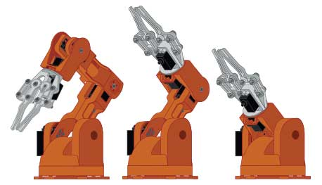

<!-- _footer: "[Download as a PDF](https://github.com/UniOfGreenwich/GEEN1064_Lectures/raw/gh-pages/content/RoboticArm/RoboticArm.pdf)" -->

# Robotic Arm

    Module Code: GEEN1064

    Module Name: Engineering Design and Implementation

    Lecturer: Seb Blair BEng(H) PGCAP MIET MIHEEM FHEA

---

## Braccio 

Braccio/Braccia [Brattcho/Brattcha] is the Italian word for arm.




---

## Functions you should NOT use

```c
void roboticArmBegin();
void processCommand();
int whichMotor(String l_Command, String l_Motor);
void moveServo(Servo &servo,..., const char *servoName);
void softStart(int soft_start_level);
void softwarePWM(int high_time, int low_time);
```
---

## Moving Motors Indiviually
`stepDelay`: Delay in milliseconds between each step, controlling the speed of movement, between 10 & 30
```c
void -moveBase(int stepDelay, int vBase);
void moveShoulder(int stepDelay, int vShoulder);
void moveElbow(int stepDelay, int vElbow);
void moveWrist_Ver(int stepDelay, int vWrist_ver);
void moveWrist_Rot(int stepDelay, int vWrist_rot);
void moveGripper(int stepDelay, int vgripper);
```

```c
moveBase(10, 180); // move base to 180 degrees
```

---

## Move all motors

Note: This code is one line

```c
void roboticArmMovement(int stepDelay, int vBase,\
    int vShoulder, int vElbow, int vWrist_ver, int vWrist_rot, int vgripper)
```

```c
//                (SD,  BA,    SH,   EL,   WV,   WR,  GR);
RoboticArmMovement(20,  180,   30,   10,   60,   90,  73);
```

Robot moves in the following order:

 - base -> shoulder -> elbow -> wrist vertical -> wrist rotation -> gripper 


---

## Some other useful functions

```c
void printPosition() {

  Serial.print("B: ");
  Serial.print(step_base);
  Serial.print(" S: ");
  Serial.print(step_shoulder);
  Serial.print(" E: ");
  Serial.print(step_elbow);
  Serial.print(" V: ");
  Serial.print(step_wrist_ver);
  Serial.print(" R: ");
  Serial.print(step_wrist_rot);
  Serial.print(" G: ");
  Serial.println(step_gripper);
}
```

---

## Some other useful functions

<div style=font-size:23px">

```c
void homePosition() {
  //For each step motor this set up the initial degree
  base.write(90);
  shoulder.write(90);
  elbow.write(180);
  wrist_ver.write(180);
  wrist_rot.write(90);
  gripper.write(10);
  delay(1000);
  //Previous step motor position
  step_base = 90;
  step_shoulder = 90;
  step_elbow = 180;
  step_wrist_ver = 180;
  step_wrist_rot = 90;
  step_gripper = 10;

  Serial.println("In Home position: B90 S90 E180 V180 R90 G10");
}
```

</div>

---

## Source code 

`RoboticArm.ino`

```
...

Serial.println("");
Serial.println("First Movement");
                //(SD, BA,  SH, EL, WV, WR, GR);
roboticArmMovement(20, 180, 30, 10, 60, 90, 73);
//Wait 2 second recommended for power to discharge from the servos
delay(2000);

Serial.println("");
Serial.println("Second Movement");
Serial.println("");

                //(SD, BA, SH, EL,  WV, WR, GR);
roboticArmMovement(20, 0, 120, 10, 100, 10, 10);
// Wait 2 second recommended for power to discharge from the servos
delay(2000);
```
---

## Source code

`Robot_Arm_Manual_Instructions_via_serial.ino`

```c
/*Code here one once during startup*/
void setup() {
    initialiseRoboticArm(); // Must be called before using braccio!
}

/*Code here runs forever!*/
void loop() {
    
    // waits for your commands via the serial monitor and then executes them
    serialListener();
}
```
