# Sensors With Arduino Development Board 

    Module Code: GEEN1064

    Module Name: Engineering Design and Implementation

    Lecturer: Seb Blair BEng(H) PGCAP MIET MIHEEM FHEA

---

## What is (and is not) A Microcontroller (µC) PT 1

<div style="font-size:24px">

- A µC is a small, self-contained computer that is housed on asingle integrated circuit, or microchip.

- They differ from your desktop computer in that they are typically dedicated to a single function, and are most often embedded in other devices (e.g. mobile phones; household electronics).

- A µC is an Integrated Circuit (IC) device used for controlling other portions of an electronic system

- These devices are optimized for embedded applications that require both processing functionality and agile, responsive interaction with digital, analogue, or electromechanical components.

</div>

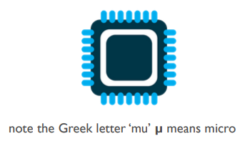

---

## What is (and is not) A Microcontroller (µC) PT 2

- “µC” is a well-chosen name because it emphasizes defining characteristics of this product category. The prefix “µ” implies smallness and the term "controller" here implies an enhanced ability to perform control functions.

-  As stated above, this functionality is the result of combining a digital processor and digital memory with additional hardware that is specifically designed to help the µC interact with other components.


---

## Arduino Uno

Prototype Board from Arduino
- The Uno is a µC development board with an Atmega328P Chip
- 14 digital Input/Output (I/O) pins
- 6 Analogue I/O pins (e.g. temperature sensors)
- A 16 MHz quartz crystal


---

## ATMega-328P Chip


---

## Signals

- **Digital**
  - value is either HIGH or LOW ( on/off, one/zero) e.g. switch state

- **Analogue**
  - value ranges, usually from 0-255. e.g. LED brightness, motor speed, etc.

---

## Analogue Sensors

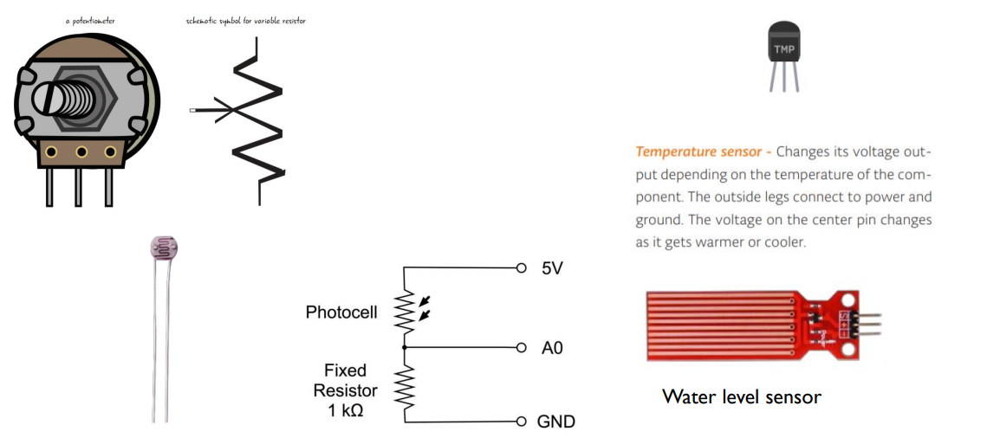

---

## Digital Sensors

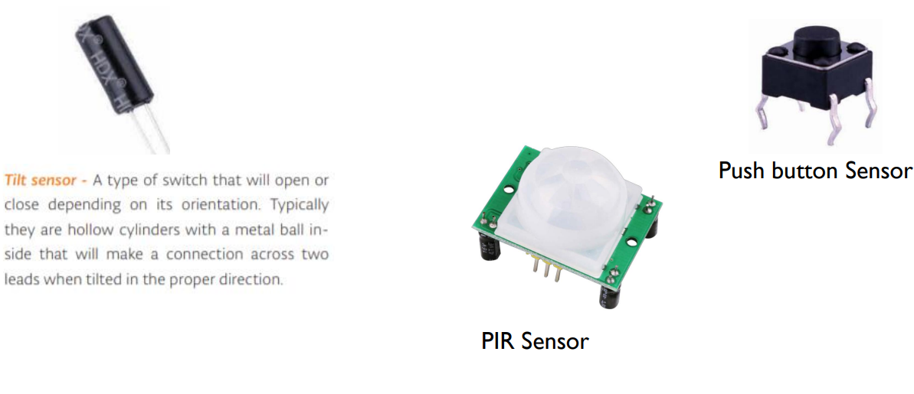

---

## Digital To Analogue Conversion With Pulse Width Modulation (PWM)

- Computer cannot output analogue signal
    - Usually digital 0 or 5 volt

- But this can be faked by PWM
    - by averaging digital signal flipping between two values

- The duty cycle is defined as the ratio between the pulse duration, or pulse width and the period of a rectangular waveform and measured in percentage


---

## PWM Continued

- Used everywhere (motor speed control, light dimmer, power supplies etc.)​

- PWM rapidly turns the output pin high and low over a fixed period of time. ​

- The change happens faster than the human eye can see

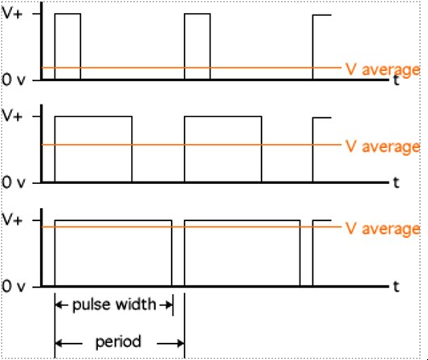

---

## PWM Pins on the Arduino Uno

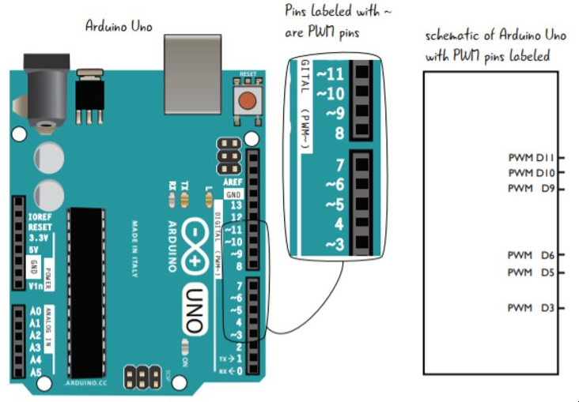

each one of the pins is marked by the ~ symbol on the Arduino Uno​

---
## PWM Pins and Frequency​

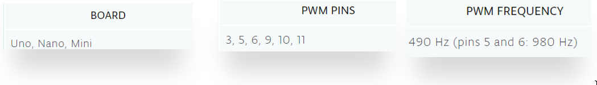

The PWM turns the pin on and off so quickly, the effective value for the voltage that comes out of the pin is the average time the pin is set to HIGH. Note that the Arduino is not producing a different value of voltage but rather just using this trick of averages to create the analog value.​

----

## Digital To Analogue Conversion Using `Analogwrite()`​

`analogWrite()`, the pin will generate a steady rectangular wave of the specified duty cycle until the next call to `analogWrite()` or a call to `digitalRead()` or `digitalWrite()` on the same pin​.

**Syntax**

- `analogWrite(pin, value)`

**Parameters**

- `pin`: the Arduino pin to write to. Allowed data types: `int`.
- `value`: the duty cycle: between 0 (always off) and 255 (always on @110% of the voltage). Allowed data types: `int`.


---

## Example of Dimmer Switch

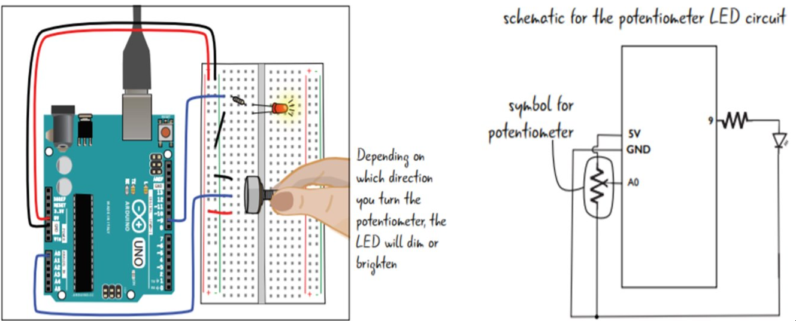

---

## Variable Resistance /  Voltages

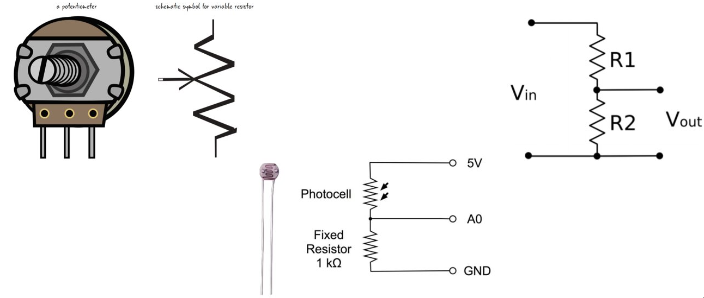

---

## Reduce a Voltage to a Measurable Level​

**Using a voltage divider**

The output voltage (Vout) will be a fraction of the input voltage (Vin) according to the formula:

$$V_{out}= \frac{R2}{R1 + R2} \cdot V_{in}$$


For exampe, if R1 is $470\Omega$, R2 is $270\Omega$, and Vin is $5V$:

$$ 3.18V = \frac{470}{270-470} \cdot 5V \Lleftarrow V_{out} = \frac{R2}{R1 + R2} \cdot V_{in} $$

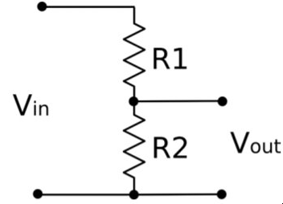

---

## Analogue to Digita Conversion by `analogRead()` Function

`analogRead()` takes one argument: what pi it should take a voltage reading on. The Value, which is between 0 and 1023, is a representation of the voltage on the pin.

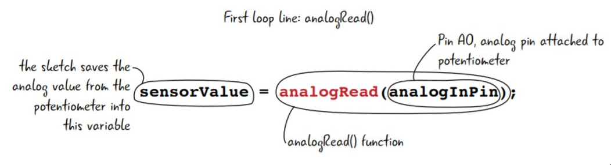

---

## Analogue Reading

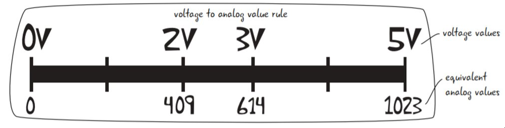

- Analog input pins read voltage levels frm 0V to 5V and convert them to a range of values from 0 to 1023
- So, at 2 volts you get a value of 409
- At 3 vols you get a value of 614
- Thes value are automatically calculated by the program.

---

## Adjusting Values: `map()`

The `map()` function is used to scale values from one range to another:

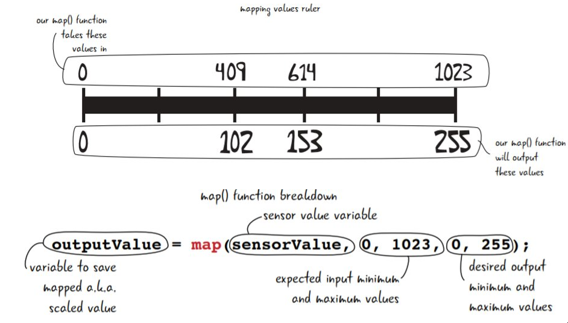

---

## Map Equation

- `map(val, in_min, in_max,out_min,out_max)` 

- `map(100,0,1023,0,255)`

$$mapped=  (val - in_{min}) \cdot \frac{(out_{max} - out_{min} + 1)}{(in_{max} - in_{min} + 1)} + out_{min}$$

<p>

</p>

$$ 
  \begin{aligned}
      mapped &=  (100 - 0) \cdot \frac{(255 - 0 + 1)}{(1023 - 0 + 1)} + 0 \\
            &=  100 \cdot \frac{(256)}{(1023)} + 0 \\
            &=  100 \cdot 0.2502 + 0 \\
      25.02 & =  100\cdot 0.2502
  \end{aligned}
$$

---

## Mapping not always needed

- `tone(speakerOutPin,sensorValue)` function takes two arguments: 
  - `speakerOutPin` is set to pin 11
  - `sensorValue` the frequency of te tone to be played.

- You don't need to map this value to te smaller scale, since the range of frequencies accepted by the `tone()` function is much wider than 0-255.

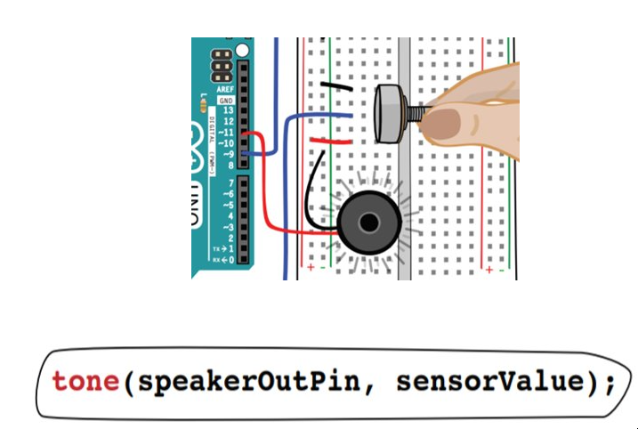

---

## Analogue and Digital functios

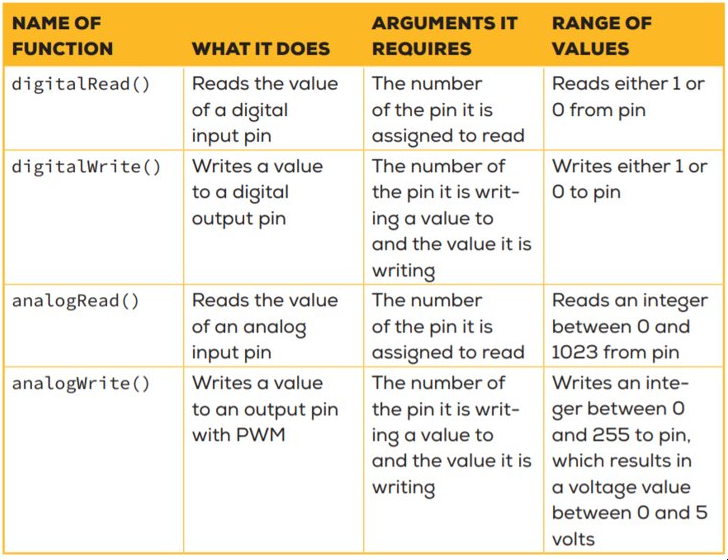

---
## Seria Communication


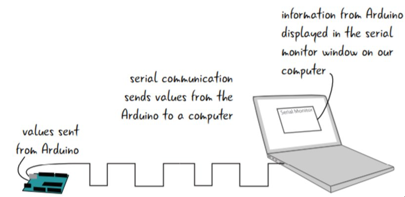

By changing te value of the voltage along a wire from HIG to LOW, the Arduino can transmit information across the USB cable to a computer

---

## Serial Monitor Code

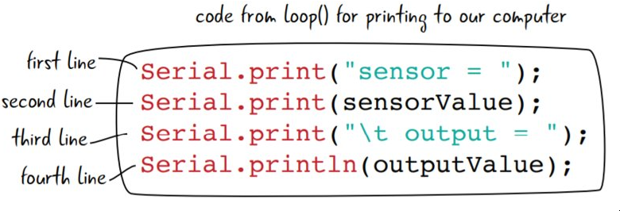

- `\t` tells the serial monitor to include a tab (a set of spaces) to be printed out

- `Serial.println()` includes a line break, which makes the serial information easy to read.

---

## Why do you need a `delay()`

```c
delay(2); // 2 milliseconds delay
delay(1000); // 1000 milliseconds delay
delay(332); // 332 milliseconds delay
```

- `delay()` pauses the program for just moment so that there is enough tim to take another sensor reading.

- There is a limit on how many accurate sensor readings can be taken every second, so the delay helps to space out your senor readings long enough to maintain good readings.

---

## Reflection of Code How to Write `for` Loop

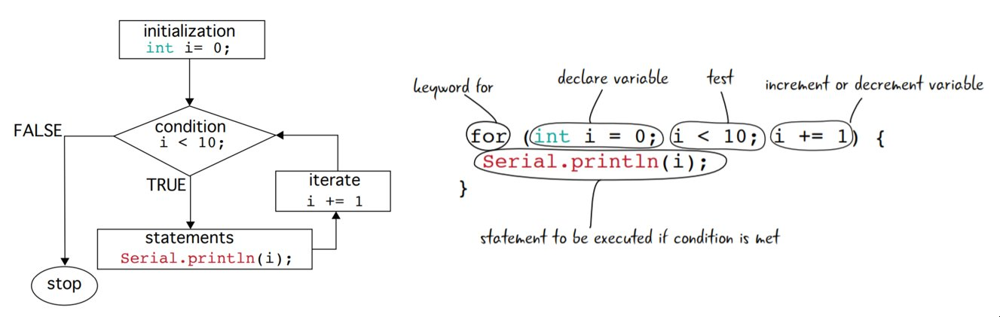

---

## Compound Opertors

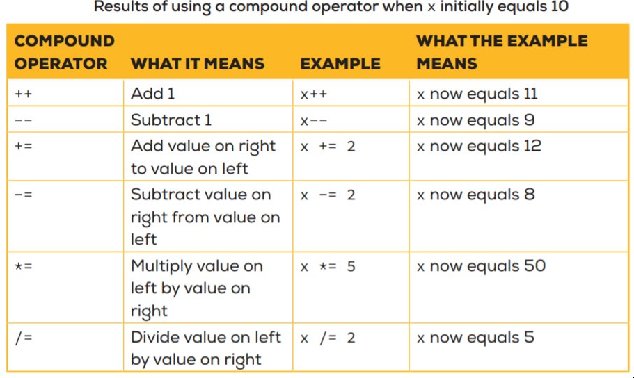

---

## Summary

- `analogRead()`
    - Analogue to digital conversion

- `analogWrite()`
  - Digital to analog conversion

- `digitaWrite()`
  - Digital ouput, writes either 5v or 0v to an output digital pin

- `digitalRead()`
  - Digital input, writes either 5v or 0v to an output digital pin

